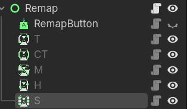
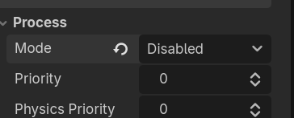
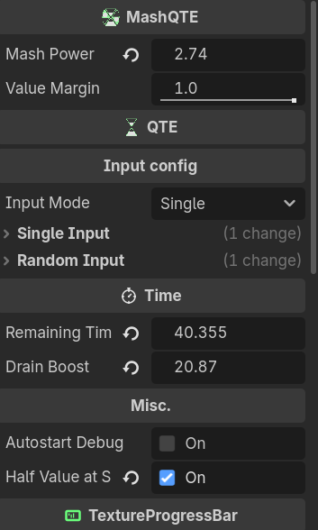
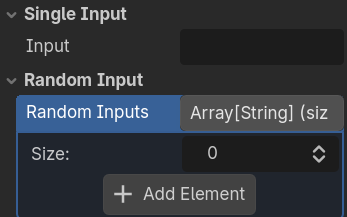

# Documentation and manual

### **Important: Unfortunately the QTE nodes are not creatable in-script and must already be added in a Scene.**


It is recommended to have only 1 of each QTE Node you want to use, which can be accessed by anything in the Scene such as enemies or interactable objects

# Basic Setup

Create a QTE Node in your scene. Make sure to also disable the process mode in the editor



In this example, we will use MashQTE



Here you will set up variables such as the mashing power (which counters the value drainage), the Input and value margin. Because the MashQTE's value constantly rises and lowers, it won't perfectly reach the max value when you mash the Input. That is why it uses a value margin, so it can reach a certain threshold that makes it possible to succeed the QTE. The value margin is also present in HoldQTE. It is also recommended that mash power is 10x smaller than drain boost

**Important note for HoldQTE and MashQTE: Make sure that the Hold power and Mash power are higher than drain boost**

Then load up a progress texture, you can use the template one provided in the Addon

# Input modes

There are 3(2) Input modes: Single, Random, Sequence. Sequence however is not a regular input mode and is only intended to be used for SequenceQTE. Not having an Input or random Input list will also throw an error



# How each Node works

## CountdownQTE 
CountdownQTE uses a timer created in the abstract class to set it's value

```ruby
    func on_launch() -> void:
	    max_value = remaining_time

    func qte_input_handle(delta: float) -> void:
	    set_value_no_signal(timer.time_left)
	    if Input.is_action_just_pressed(input):
		    succeed()
```

on_launch acts as the _ready() function for the QTE Nodes. Attempting to write something in the _ready() function of any child class will throw in an error

## MashQTE 
CountdownQTE uses a timer created in the abstract class to set it's value. This, HoldQTE and TimedQTE do not use the abstract class's Timer. They instead drain the value via the drain boost variable<

```ruby
@export var mash_power: float = 10.0
@export_range(0.01, 1.0, 0.01) var value_margin: float = 1.0

func qte_input_handle(delta: float) -> void:
	value -= delta * drain_boost
	value = clampf(value, 0.0, max_value)
	if value >= max_value - value_margin:
		succeed()
	if Input.is_action_just_pressed(selected_input):
		value += mash_power
```

## HoldQTE 
The functionality of HoldQTE is almost the same as MashQTE, with the only difference being that it raises the progress value when you hold the input key instead of pressing it

```ruby
@export var hold_power: float = 2.0
@export_range(0.01, 1.0, 0.01) var value_margin: float = 1.0

func qte_input_handle(delta: float) -> void:
	value -= delta * drain_boost
	value = clampf(value, 0.0, max_value)
	if value >= max_value - value_margin:
		succeed()
	if Input.is_action_pressed(selected_input):
		value += delta * hold_power
```

## TimedQTE 

```ruby
@export var range: float = 1.0
@export var range_offset: float = 0.0
var in_range: bool = false

func qte_input_handle(delta: float) -> void:
	value += delta * drain_boost
```
The TimedQTE works differently than the other QTE nodes. When it rises to max value or reaches 0, it's speed flips by -1 so it's value change reverses. The Node requires the value to be at a specific range for the user to be able to succeed. For a better visual, you can change the script to have the texture Modulate color change when it's in-range or use an overlay texture for better indication. The variable in-range checks if the progress Value is in a certain range defined by the middle of the total Value with a range offset

```ruby
	if value <= 0.0 or value >= max_value:
		drain_boost *= -1
```
```ruby
	in_range = value > ((max_value / 2) - range) and value < ((max_value / 2) + range)
	if Input.is_action_just_pressed(selected_input):
		if in_range:
			succeed()
		else:
			fail()
```

## SequenceQTE

SequenceQTE is the only Node which uses the Sequence enum Value of InputModes of the abstract class

```ruby
@export var sequence: Array[String]
@export var retry_on_wrong_letter: bool = false
@export var mix_inputs_on_retry: bool = false
var index: int = 0

func on_launch() -> void:
	label.text = ""
	for s: String in sequence:
		label.text += s
	index = 0
	set_process_input(true)

func qte_input_handle(delta: float) -> void:
	set_value_no_signal(timer.time_left)
	
func _input(event: InputEvent) -> void:
	if event.is_pressed() and event is InputEventKey:
		if InputMap.action_has_event(sequence[index], event):
			if index < sequence.size():
				label.text = label.text.replace(sequence[index], "[color=green]" + sequence[index] + "[/color]")
				index += 1
				if index == sequence.size():
					set_process_input(false)
					succeed()
```

When the QTE is launched, it enables the Input process where it scans the user's keyboard and check if it matches any of the inputs found in the sequence. The user can also tick an option that makes the QTE restart and mix the sequence order when you fail


# The Abstract class: QTE


## Functions and Signals

```ruby
func deactivate() -> void:
	hide()
	timer.stop()
	Engine.set_time_scale(1.0)
	set_process_mode(Node.PROCESS_MODE_DISABLED)
	set_process_input(false)
```

deactivate is called when you succeed or fail the QTE. It stops the timer, resets the Engine time scale back to 1 and disables both process and input process

```ruby
func on_launch() -> void:
	launched.emit()

func fail() -> void:
	failed.emit()
	deactivate()
	
func succeed() -> void:
	success.emit()
	deactivate()
```

When the QTE is launched, it enables the Input process where it scans the user's keyboard and check if it matches any of the inputs found in the sequence. The user can also tick an option that makes the QTE restart and mix the sequence order when you fail

When you start the QTE by calling launch_qte(), it sets the process mode to inherit (enabled), starts the timer and also sets the Engine time scale to 0.5

The _ready() function of the QTE class creates a RichTextLabel and a Timer node. The timer is binded to the fail function

remaining_time is the time value for the Timer
half_value_at_start sets the QTE progress Value at half. This is meant for MashQTE and HoldQTE since they automatically call succeed() if they start at max value


qte_input_handle() is handled in the _physics_process() of the Nodes.